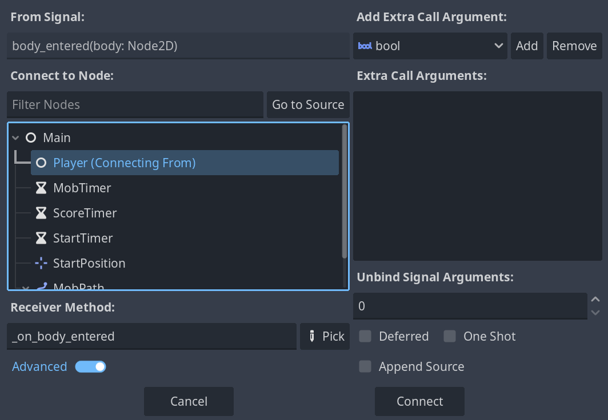
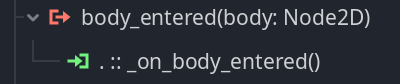
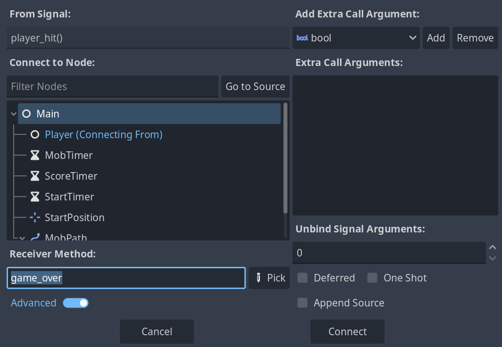
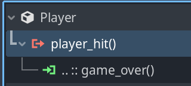

# Using J-Dax's Godot 4.3 code (with some modifications) to complete Godot 4.6's Your First 2D Game Tutorial in C++

([J-Dax's original project](https://github.com/j-dax/gd-cpp) was released under the BSD-3 license. I'm releasing this modified copy of the project under the MIT license.)

Practically all of the code in this repository comes from one of the following sources:

1. [J-Dax's C++ code for Version 4.3 of the YF2DG project](https://github.com/j-dax/gd-cpp) (released under the BSD-3 license)

1. [The official YFD2G guides for Godot 4.5](https://docs.godotengine.org/en/4.5/getting_started/first_2d_game/index.html) [and Godot 4.6](https://docs.godotengine.org/en/4.6/getting_started/first_2d_game/index.html)

    (Godot 4.6 got released while I was working on this project, so once I got to the Heads up display section of the tutorial, I switched from the Godot 4.5 documentation to [the Godot 4.6 documentation](https://docs.godotengine.org/en/4.6/getting_started/first_2d_game/index.html) as a reference.)

1. The [Getting started](https://docs.godotengine.org/en/4.6/tutorials/scripting/cpp/gdextension_cpp_example.html) page within Godot's GDExtension documentation.

1. [Version 3.5 of the YF2DG project](https://docs.godotengine.org/en/3.5/getting_started/first_2d_game/03.coding_the_player.html). (This was the most recent version of the 'Your First 2D Game documentation' to include C++ code examples. It proved very helpful in figuring out which sections of J-Dax's code to present for each corresponding code block. Having three monitors proved very helpful during this process!) 

1. The [godot-cpp-template](https://github.com/godotengine/godot-cpp-template?tab=Unlicense-1-ov-file#readme) repository

**This repository seeks to complement these resources by:**

1. Laying out the C++ code step by step, similar to how the official tutorial presents GDScript and C# code bit by bit. (This repository will also contain completed copies of each C++ file--but it can be tricky, and a bit intimidating, to use those finalized versions as learning aids.) 

    (This process generally involved navigating to code blocks within version 4.5 or 4.6 of the tutorial; checking the code within the equivalent C++ code block in version 3.5 ; finding code within J-Dax's repository that was similar to that block; and then pasting that code into the Readme.)

1. Incorporating a few updates to J-Dax's code that make it compatible with Godot 4.6.

1. Adding some additional comments on the code and documentation that you might find helpful in your learning journey (especially if you're a relative beginner to Godot or GDExtension).

A few other notes:

1. This project is *not* a replacement for the [official Godot YF2DG tutorial](https://docs.godotengine.org/en/4.5/getting_started/first_2d_game). You'll still need to complete most of the steps found in that tutorial in order to get your game working. The purpose of this project is to (1) provide equivalent C++ code for the GDScript and C# code contained in the tutorial and (2) point out sections where your C++-based workflow will differ from the standard workflow. (Examples include creating new classes and adding signals.)

1. I'm working within Linux Mint, but this guide ought to be helpful for other operating systems also.

1. My personal reason for working on this project is that I want to learn how to code games entirely in C++ within Godot. This is *not* the recommended approach, as GDScript will often allow for faster coding and deployment; it's simply the method that I find the most interesting, though far from the most convenient (or rational!). 

1. This project won't run on its own because it's missing certain assets (e.g. fonts, artwork, and sounds) that are provided via the official Godot YF2DG tutorial. However, if you follow the steps within that tutorial, you'll end up with the materials you need on your own computer--which can then be paired with the C++ code found within this README.

--Ken Burchfiel

## Steps:

1. If you haven't already, make sure you have a compiled copy of the [godot-cpp](https://github.com/godotengine/godot-cpp) repository on your computer. ([This guide](https://docs.godotengine.org/en/4.6/tutorials/scripting/cpp/gdextension_cpp_example.html), which I strongly recommend completing before you tackle the YF2DG project, will teach you how to do so.)

    Note: As of March 3, 2026, the latest copy of the godot-cpp code (10.x) doesn't yet have a stable release. I found that the beta version that I downloaded worked fine; however, the 4.5 version (which of godot-cpp I initially started with) might also work well. See [the Versioning section](https://github.com/godotengine/godot-cpp#versioning) of the godot-cpp documentation for more details.

1. Follow the steps in the [official YFD2G guide for Godot 4.6](https://docs.godotengine.org/en/4.6/getting_started/first_2d_game/index.html) guide until you reach the 'Coding the player' section.

    Note: Based on J-Dax's guide, I'm storing my Godot Project documents within a 'project' folder inside my main folder. Here's what my folder structure looks like at this point:

        cpp_yf2dg/
        ----project/    
    
1. Once you get to the [Coding the player](https://docs.godotengine.org/en/4.6/getting_started/first_2d_game/03.coding_the_player.html) page, you'll be able to begin adding C++ to your game!

    **A quick note:** The documentation will instruct you to add pre-existing nodes to your scene, then link GDScript files to them. However, when using GDExtension, you'll instead need to define your class within your C++ code, *then* add an instance of that class to your project file. (Simply adding a new node, then renaming it as the same name as your class, won't suffice. This may seem obvious, but I spent more debugging time than I'd like to admit because, later in this project, I renamed an existing node 'Main' instead of importing my custom Main class into a scene.)

1. First, copy your compiled godot-cpp folder into your root folder. [Since this folder was around 196 MB in size, I imagine there's a way to avoid directly copying it--but this approach will work for now.] Also add a src/ folder. Your directory should now have the following structure:

        cpp_yf2dg/
        ----project/    
        ----godot-cpp/
        ----src/

    Next, within your src/ folder, add three subfolders: entity/, registry/, and scene/.

    While the official guide discusses attaching a script to your player, this step doesn't apply to C++ code, so you can skip it.
    
1. Once you get to the first code block within this section (which is preceded by "Start by declaring the member variables this object will need"), add the following C++ code to /src/entity/player.h:

    ```
    #pragma once

    #include <godot_cpp/classes/area2d.hpp>

    using namespace godot;

    class Player : public Area2D {
        GDCLASS(Player, Area2D)

    private:
        int speed;
        Size2 screen_size;

        static void _bind_methods();
    public:
        Player();
        ~Player() = default;

        void start(Vector2 position);

        // signals
        void set_speed(const int);
        int get_speed() const;
        //void _on_body_entered(Node2D *node);

        // engine binding
        void _ready() override;
        void _process(double) override;
    };

    ```

    This code has a number of similarities to the C++ code within [Version 3.5 of the YF2DG project](https://docs.godotengine.org/en/3.5/getting_started/first_2d_game/03.coding_the_player.html).


1. Next, after the "The _ready() function is called when a node enters the scene tree, which is a good time to find the size of the game window:" text, add the following code to /src/entity/player.cpp:

    ```
    #include "player.h"

    #include <godot_cpp/classes/animated_sprite2d.hpp>
    #include <godot_cpp/classes/collision_shape2d.hpp>
    #include <godot_cpp/classes/input.hpp>
    #include <godot_cpp/classes/input_map.hpp>
    #include <godot_cpp/variant/utility_functions.hpp>

    using namespace godot;

    void Player::_ready() {
        // https://github.com/godotengine/godot/issues/74993
        // workaround available: in _ready
        auto im = InputMap::get_singleton();
        im->load_from_project_settings();

        screen_size = get_viewport_rect().size;
    }
    ```

1. After you get to "You can detect whether a key is pressed using `Input.is_action_pressed()`, which returns `true` if it's pressed or `false` if it isn't.", add the following C++ code right below the `Player::_ready()` function:

    ```
    void Player::_process(double delta) {
        auto input = Input::get_singleton();
        auto velocity = Vector2(0, 0);
        if (input->is_action_pressed("move_up")) {
            velocity.y -= 1;
        }
        if (input->is_action_pressed("move_down")) {
            velocity.y += 1;
        }
        if (input->is_action_pressed("move_left")) {
            velocity.x -= 1;
        }
        if (input->is_action_pressed("move_right")) {
            velocity.x += 1;
        }

        auto animated_sprite_2d = Node::get_node<AnimatedSprite2D>(
            "AnimatedSprite2D");
        if (velocity.x != 0) {
            animated_sprite_2d->set_animation("walk");
            animated_sprite_2d->set_flip_v(false);
            animated_sprite_2d->set_flip_h(velocity.x < 0);
        } else if (velocity.y != 0) {
            animated_sprite_2d->set_animation("up");
            animated_sprite_2d->set_flip_v(velocity.y > 0);
        }

        if (velocity.length() > 0) {
            velocity = velocity.normalized() * speed;
            animated_sprite_2d->play();
        } else {
            animated_sprite_2d->stop();
        }
    ```

1. In addition, add the following code right below `using namespace godot;` so that Godot can make sense of our `speed` variable:

    (Source: J-Dax's player.cpp file)

    ```
    void Player::_bind_methods() {
        // expose speed in the editor
        ClassDB::bind_method(D_METHOD("get_speed"), &Player::get_speed);
        ClassDB::bind_method(D_METHOD("set_speed", "speed"), &Player::set_speed);
        ADD_PROPERTY(PropertyInfo(Variant::INT, "speed"), "set_speed", "get_speed");
    }

    Player::Player() {
        speed = 400;
    }

    void Player::set_speed(const int pSpeed) {
        speed = pSpeed;
    }

    int Player::get_speed() const {
        return speed;
    }

    ```


1. When you reach the code block that follows "Add the following to the bottom of the _process function (make sure it's not indented under the else):" text box, add the code shown below before the end of your `_process()` function:

    ```
    auto new_position = get_position();
    new_position += velocity * delta;

    new_position.x = Math::clamp(new_position.x, 0.0f, screen_size.x);
    new_position.y = Math::clamp(new_position.y, 0.0f, screen_size.y);

    set_position(new_position);
    ```

1. This will also be a good time to fill in the registry folder. First, save the following file as /src/registry/register_types.h:

    (Source: https://docs.godotengine.org/en/4.5/tutorials/scripting/cpp/gdextension_cpp_example.html)

    Note that the name of the function that returns GDE_EXPORT (in this case, example_library_init) will need to match the name of your entry_symbol value within a .gdextension document that you'll create later on.


    ```
    #pragma once

    #include <godot_cpp/core/class_db.hpp>

    using namespace godot;

    void initialize_example_module(ModuleInitializationLevel p_level);
    void uninitialize_example_module(ModuleInitializationLevel p_level);
    ```

    Next, save the following file as /src/registry/register_types.cpp:

    (The following code is based largely on https://docs.godotengine.org/en/4.6/tutorials/scripting/cpp/gdextension_cpp_example.html .)

    ```
    #include "register_types.h"

    #include "entity/player.h"

    #include <gdextension_interface.h>
    #include <godot_cpp/core/defs.hpp>
    #include <godot_cpp/godot.hpp>

    using namespace godot;

    void initialize_example_module(ModuleInitializationLevel p_level) {
        if (p_level != MODULE_INITIALIZATION_LEVEL_SCENE) {
            return;
        }

        GDREGISTER_CLASS(Player);
    }

    void uninitialize_example_module(ModuleInitializationLevel p_level) {
        if (p_level != MODULE_INITIALIZATION_LEVEL_SCENE) {
            return;
        }
    }

    extern "C" {
    // Initialization.
    GDExtensionBool GDE_EXPORT example_library_init(
    GDExtensionInterfaceGetProcAddress p_get_proc_address, 
    const GDExtensionClassLibraryPtr p_library, 
    GDExtensionInitialization *r_initialization) {
        godot::GDExtensionBinding::InitObject init_obj(
            p_get_proc_address, p_library, r_initialization);

        init_obj.register_initializer(initialize_example_module);
        init_obj.register_terminator(uninitialize_example_module);
        init_obj.set_minimum_library_initialization_level(
            MODULE_INITIALIZATION_LEVEL_SCENE);

        return init_obj.init();
    }
    }
    ```

    We'll periodically update this .cpp file with additional entries for the other classes we'll create, but such updates will be much shorter in length.

1. Next, add the following code within your root folder (i.e. at the same level as your /src, /project, and /godot-cpp folders) to a file named SConstruct (no extension):

    (Source: Downloadable SConstruct file within https://docs.godotengine.org/en/4.5/tutorials/scripting/cpp/gdextension_cpp_example.html )

    Note that, because our C++ files are all located within subfolders, we'll use Glob("src/**/*.cpp") as our `sources` value rather than Glob("src/*.cpp").

    ```
    #!/usr/bin/env python
    import os
    import sys

    env = SConscript("godot-cpp/SConstruct")

    # For reference:
    # - CCFLAGS are compilation flags shared between C and C++
    # - CFLAGS are for C-specific compilation flags
    # - CXXFLAGS are for C++-specific compilation flags
    # - CPPFLAGS are for pre-processor flags
    # - CPPDEFINES are for pre-processor defines
    # - LINKFLAGS are for linking flags

    # tweak this if you want to use different folders, or more folders, to store your source code in.
    env.Append(CPPPATH=["src/"])
    sources = Glob("src/**/*.cpp")

    if env["platform"] == "macos":
        library = env.SharedLibrary(
            "project/bin/libexample.{}.{}.framework/libexample.{}.{}".format(
                env["platform"], env["target"], env["platform"], env["target"]
            ),
            source=sources,
        )
    elif env["platform"] == "ios":
        if env["ios_simulator"]:
            library = env.StaticLibrary(
                "project/bin/libexample.{}.{}.simulator.a".format(env["platform"], env["target"]),
                source=sources,
            )
        else:
            library = env.StaticLibrary(
                "project/bin/libexample.{}.{}.a".format(env["platform"], env["target"]),
                source=sources,
            )
    else:
        library = env.SharedLibrary(
            "project/bin/libexample{}{}".format(env["suffix"], env["SHLIBSUFFIX"]),
            source=sources,
        )

    Default(library)

    ```

1. Open a terminal; navigate to your root folder (i.e. the one that contains your 'godot-cpp', 'src', and 'project' folders); and run `scons platform=linux` (replacing the OS with your own OS as needed). (You may also be able to run `scons` on its own without having to mention your OS name.)

1. Navigate to your new /project/bin folder; create a new file named gdexample.gdextension; and then add the following code to it:

    (Source: https://docs.godotengine.org/en/4.5/tutorials/scripting/cpp/gdextension_cpp_example.html#id4)

    Note: The original `libgdexample` values were changed to `libexample` so as to match the filename patterns in our SConstruct script.

    ```
    [configuration]

    entry_symbol = "gdextension_init"
    compatibility_minimum = "4.5"
    reloadable = true

    [libraries]

    macos.debug = "res://bin/libexample.macos.template_debug.framework"
    macos.release = "res://bin/libexample.macos.template_release.framework"
    ios.debug = "res://bin/libexample.ios.template_debug.xcframework"
    ios.release = "res://bin/libexample.ios.template_release.xcframework"
    windows.debug.x86_32 = "res://bin/libexample.windows.template_debug.x86_32.dll"
    windows.release.x86_32 = "res://bin/libexample.windows.template_release.x86_32.dll"
    windows.debug.x86_64 = "res://bin/libexample.windows.template_debug.x86_64.dll"
    windows.release.x86_64 = "res://bin/libexample.windows.template_release.x86_64.dll"
    linux.debug.x86_64 = "res://bin/libexample.linux.template_debug.x86_64.so"
    linux.release.x86_64 = "res://bin/libexample.linux.template_release.x86_64.so"
    linux.debug.arm64 = "res://bin/libexample.linux.template_debug.arm64.so"
    linux.release.arm64 = "res://bin/libexample.linux.template_release.arm64.so"
    linux.debug.rv64 = "res://bin/libexample.linux.template_debug.rv64.so"
    linux.release.rv64 = "res://bin/libexample.linux.template_release.rv64.so"
    android.debug.x86_64 = "res://bin/libexample.android.template_debug.x86_64.so"
    android.release.x86_64 = "res://bin/libexample.android.template_release.x86_64.so"
    android.debug.arm64 = "res://bin/libexample.android.template_debug.arm64.so"
    android.release.arm64 = "res://bin/libexample.android.template_release.arm64.so"

    [dependencies]
    ios.debug = {
        "res://bin/libgodot-cpp.ios.template_debug.xcframework": ""
    }
    ios.release = {
        "res://bin/libgodot-cpp.ios.template_release.xcframework": ""
    }

    ```

1. Go back into the Godot editor. (You may need to exit out of it and reload it if it was already open.) Click on your existing Player node; choose 'Change type'; search for 'Player'; and then click Change. This will replace your Area2D node with your C++-based Player class.

    (Alternatively, you could probably have added an initial copy of the new C++-based Player class to your scene, *then* completed all of the remaining Player setup tasks described earlier.)

1. Hit play on the top right to test out the scene. You should be able to move the player around with your keyboard.

1. When you get to the first code block within the 'Choosing animations' section of the 'Coding the player' documentation, go to the following line within your player.cpp code:

    ```
    auto animated_sprite_2d = Node::get_node<AnimatedSprite2D>(
            "AnimatedSprite2D");
    ```

    Next, add the following code directly below this line:

    ```       
        if (velocity.x != 0) {
            animated_sprite_2d->set_animation("walk");
            animated_sprite_2d->set_flip_v(false);
            animated_sprite_2d->set_flip_h(velocity.x < 0);
        } else if (velocity.y != 0) {
            animated_sprite_2d->set_animation("up");
            animated_sprite_2d->set_flip_v(velocity.y > 0);
        }
    ```

1. Rerun `scons platform=(your_os)` within your terminal. (On Linux, and possibly other operating systems also, you can quickly do so by pressing Up Arrow on your keyboard followed by Enter--assuming that this was your most recent command.) Next, play the scene within Godot to confirm that the player's direction and animations now align better than they did previously. 


1. Next, when you get to the last code block within the 'Choosing animations' section, add the following to the end of your `void Player::_ready()` function within player.cpp:

    ```
    // You may find it helpful to comment out the following line
    // at times for debugging/testing purposes, especially 
    // earlier in the tutorial.
    hide();
    ```

    (The player will no longer be visible, as we'll want the player only appear after the completion of a countdown that we'll add in later on.)

1. For the first code block within the 'Preparing for collisions' section, add the following code to the bottom of your `Player::_bind_methods()` function within player.cpp:

    ```
    // The signal to emit when the player collides with a Mob
        ADD_SIGNAL(MethodInfo("player_hit"));
    ```

1. After rerunning `scons platform=(your_os)`, exit and relaunch Godot. You should now see a `player_hit()` signal within a new Player entry at the top of your Signals panel. (See the official documentation for more details.)

1. You can skip the Connect --> Connect a Signal entry for now. (We'll perform this step after a prerequisite code update.) Instead, navigate down to the following code block. Then, within player.h, add the following line right after `int get_speed() const;`:

    ```
    void _on_body_entered(Node2D *node);
    ```

    Then, within your player.cpp file, add the following code right above the ADD_SIGNAL line that you just added in:

    ```
    ClassDB::bind_method(D_METHOD("_on_body_entered", "node"), 
    &Player::_on_body_entered);
    ```
   
1. When you get to the next code block in the tutorial, add the following code to the very end of your player.cpp file:

    ```
    void Player::_on_body_entered(Node2D *node) {
        hide();
        get_node<CollisionShape2D>("CollisionShape2D")->set_deferred(
            StringName("set_disabled"), true);
        // Let listeners respond to hit
        emit_signal("player_hit");
    }
    ```

1. The standard, GDScript-based method of connecting signals involves (not surprisingly) some GDScript. However, we don't have to use any GDScript with our C++-based approach. Instead, when you get to the Connect --> Connect a Signal entry, perform the following steps:

    Select the Player entry within the Main scene's node tree, then double-click on the `body_entered(body: Node2D)` signal within the Player section of its Signals tab. In this box, click on the Player node (since that class is the one that contains the _on_body_entered() function); replace any existing text in the Receiver Method box with `_on_body_entered` (not `_on_body_entered()`); and click 'Connect.'

    

    If all goes well, you should then see `. :: on_body_entered()` below `player_hit()` in the Signals menu:

    

    (The single dot signifies that `_on_body_entered()` is part of the Player class.)

    If you instead see a 'Cannot connect signal' message, make sure that `_on_body_entered()` is indeed present within your player.cpp code--and that the Player node within your Player scene is indeed an instance of your custom-defined Player class.

    (It's also possible to add signals directly within your .tscn files; see the end of this tutorial for more details on that method.)

1. Finally, when you got to the last code block in this section, add the following code right below `~Player() = default;` within player.h:

    ```
    void start(Vector2 position);
    ```

    Next, add the following function above your `Player::_ready()` function within player.cpp:

    ```
    void Player::start(Vector2 position) {
        set_position(position);
        show();
        get_node<CollisionShape2D>("CollisionShape2D")->set_disabled(false);
    }
    ```

1. Rerun `scons platform=(your_os)`. If you'd like, you can temporarily comment out the `hide()` function you added in recently in order to make sure that your player is still moving around as expected. (By the way: check for any errors within the Debugger window at the bottom of the game engine window while you're running your game. The earlier you catch and address these, the better.)

1. You're now ready to move on to the [Creating the enemy](https://docs.godotengine.org/en/4.6/getting_started/first_2d_game/04.creating_the_enemy.html) section of the documentation. Once you get to the first code block (which is preceded by "Add a script to the Mob like this:"), create two new files within your src/entity/folder: mob.cpp and mob.h. Copy and paste the following code into the mob.h file:

    ```
    #pragma once

    #include <godot_cpp/classes/rigid_body2d.hpp>
    #include <godot_cpp/classes/animated_sprite2d.hpp>

    using namespace godot;

    class Mob : public RigidBody2D {
        GDCLASS(Mob, RigidBody2D)

    private:
        static void _bind_methods();
    public:
        Mob();
        ~Mob() = default;

        void start(Vector2 position, float rotation);


        //engine binding
        void _ready() override;
    };
    ```

    This code, if you haven't noticed already, is very similar to the corresponding code within player.h.

1. Once you get to the second box (i.e. the one preceded by "In `_ready()` we play the animation and randomly choose one of the three animation types:"), add the following code to mob.cpp:

    ```
    #include "mob.h"
    #include <godot_cpp/classes/animated_sprite2d.hpp>

    Mob::Mob() {}

    void Mob::start(Vector2 position, float rotation) {
        set_global_position(position);
        auto direction = rotation + godot::Math::deg_to_rad(90.0);
        direction += UtilityFunctions::randf_range(
            godot::Math::deg_to_rad(-45.0), godot::Math::deg_to_rad(45.0));
        set_global_rotation(direction);

        // Note: the following six lines were originally present within
        // Mob::_ready(); however, I found that no animations appeared
        // when they were stored there. Moving them to Mob::start()
        // resolved this issue.

        auto animated_sprite_2d = get_node<AnimatedSprite2D>(
            "AnimatedSprite2D");
        auto mob_types = animated_sprite_2d->get_sprite_frames(
        )->get_animation_names();
        animated_sprite_2d->play(mob_types[
            UtilityFunctions::randi_range(0, mob_types.size()-1)]);

        auto velocity = Vector2(
            UtilityFunctions::randf_range(150.0, 250.0), 0);
        set_linear_velocity(velocity.rotated(direction));
    }

    void Mob::_ready() {

        auto vosn = get_node<
        VisibleOnScreenNotifier2D>("VisibleOnScreenNotifier2D");
        if (!vosn->is_connected(
            "screen_exited", Callable(this, "_on_screen_leave"))) {
            vosn->connect("screen_exited", Callable(
                this, "_on_screen_leave"));
        }
    }


    ```

1. Finally, once you get to this section's final code box (which follows the text 'Connect the screen_exited() signal of the VisibleOnScreenNotifier2D node to the Mob and add this code:'), go back to your mob.h file, then add the following code right below `void start(Vector2 position, float rotation);`:

    ```
    // signals
    void _on_screen_leave();
    ```

1. You'll also need to make several additions to your mob.cpp code.

    First, add the following line below `#include <godot_cpp/classes/animated_sprite2d.hpp>`:

    ```
    #include <godot_cpp/classes/visible_on_screen_notifier2d.hpp>
    ```

    Second, add the following code below `#include <godot_cpp/variant/utility_functions.hpp>`:

    ```
    void Mob::_bind_methods() {
    ClassDB::bind_method(D_METHOD("_on_screen_leave"), &Mob::_on_screen_leave);
    }
    ``` 

    Third, add the following code just above your `Mob::_ready()` function:

    ```
    void Mob::_on_screen_leave() {
        queue_free();
    }
    ```

    Fourth, expand your `Mob::_ready()` function by adding the following code just before the closing bracket:

    ```
        auto vosn = get_node<
    VisibleOnScreenNotifier2D>("VisibleOnScreenNotifier2D");
    if (!vosn->is_connected(
        "screen_exited", Callable(this, "_on_screen_leave"))) {
        vosn->connect("screen_exited", Callable(
            this, "_on_screen_leave"));
    }
    ```

1. Finally, you'll need to make several additions to register_types.cpp. First, after `#include "entity/player.h"`, add in:

    ```
    #include "entity/mob.h"
    ```

1. Next, after `GDREGISTER_CLASS(Player);`, add in (you guessed it!):

    ```
    GDREGISTER_CLASS(Mob);
    ```

1. Go ahead and compile your project once again. Note that, if you attempt to play the Mob scene within the Godot editor, you won't see anything within the game window--but that's to be expected. Later updates will allow us to view both enemies and our player in the same scene.

1. Next, we'll move on to the [Main game scene](https://docs.godotengine.org/en/4.6/getting_started/first_2d_game/05.the_main_game_scene.html) section of the documentation. Once you get to the first code block (i.e. the one preceded by "choose the Mob scene we want to instance."), add the following code to a new file within your scene/ subfolder called main.h:

    ```
    #pragma once

    #include <godot_cpp/classes/node.hpp>
    #include <godot_cpp/classes/packed_scene.hpp>

    using namespace godot;

    class Main : public Node {
        GDCLASS(Main, Node)

    private:
        Ref<PackedScene> mob_scene;
        int score;

        static void _bind_methods();
    public:
        Main();
        ~Main() = default;

        // engine bindings
        Ref<PackedScene> get_mob_scene();
        void set_mob_scene(Ref<PackedScene>);
        void game_over();
        void new_game();

        // signal receivers
        void _on_score_timer_timeout();
        void _on_start_timer_timeout();
        void _on_mob_timer_timeout();

        // void _ready() override;
    };
    ```

1. In addition, add the following
to a new file called main.cpp:

    ```
    #include "main.h"
    #include "entity/player.h"
    #include "entity/mob.h"

    #include <godot_cpp/core/property_info.hpp>
    #include <godot_cpp/classes/audio_stream_player.hpp>
    #include <godot_cpp/classes/engine.hpp>
    #include <godot_cpp/classes/timer.hpp>
    #include <godot_cpp/classes/marker2d.hpp>
    #include <godot_cpp/classes/path_follow2d.hpp>
    #include <godot_cpp/variant/utility_functions.hpp>

    Main::Main() {
        score = 0;
    }

    void Main::_bind_methods() {
        ClassDB::bind_method(D_METHOD("get_mob_scene"), &Main::get_mob_scene);
        ClassDB::bind_method(D_METHOD("set_mob_scene", "packed_scene"), &Main::set_mob_scene);
        ADD_PROPERTY(PropertyInfo(Variant::OBJECT, "packed_scene", PROPERTY_HINT_RESOURCE_TYPE, "PackedScene"), "set_mob_scene", "get_mob_scene");


        // timers
        ClassDB::bind_method(D_METHOD("_on_score_timer_timeout"), &Main::_on_score_timer_timeout);
        ClassDB::bind_method(D_METHOD("_on_start_timer_timeout"), &Main::_on_start_timer_timeout);
        ClassDB::bind_method(D_METHOD("_on_mob_timer_timeout"), &Main::_on_mob_timer_timeout);
    }

    Ref<PackedScene> Main::get_mob_scene() {
        return mob_scene;
    }

    void Main::set_mob_scene(Ref<PackedScene> packed_scene) {
        mob_scene = packed_scene;
    }
    ```

1. Within register_types.cpp, add the following line under `#include "entity/mob.h"`:

    ```
    #include "scene/main.h"
    ```
1. Similarly, `under ClassDB::register_class<Mob>();`, add the following line:

    ```
    ClassDB::register_class<Main>();
    ```

1. For now, skip the signal-connection steps discussed in the text that follows this box. Once you get to the next code block (which is preceded by "as well as a new_game function that will set everything up for a new game:"), add the following two functions to the end of your main.cpp file:


    ```
    void Main::game_over() {
    get_node<Timer>("MobTimer")->stop();
    get_node<Timer>("ScoreTimer")->stop();
    }

    void Main::new_game() {
        score = 0;

        auto player = get_node<Player>("Player");
        auto start_position = get_node<Marker2D>("StartPosition");
        player->start(start_position->get_position());

        get_node<Timer>("StartTimer")->start();
    }

    In addition, add the following to the end of your `_bind_methods()` function within that same file:


    ```
    ClassDB::bind_method(D_METHOD("game_over"), &Main::game_over);
    ClassDB::bind_method(D_METHOD("new_game"), &Main::new_game);
    ```

1. Now that we've added a `game_over()` function, we can pass this to the signal connection box in the editor. Go to the Player entry within the Main scene's node tree, then double-click on the `player_hit()` signal within the Player section of its Signals tab. In this box, **click on the Main node** (since that class is the one that contains the game_over() function); replace any existing text in the Receiver Method box with 'game_over' (not game_over()); and click 'Connect.'

    

    You should then see `.. :: game_over()` below `player_hit()` in the Signals menu:

    

    (The double dots signify that `game_over()` is part of the class that contains the Player class--in this case, the Main class.)

1. As usual, skip the signal-connection steps that follow this code block for now--as we'll need to define certain functions in our code on which they depend before we can add in those connections.

1. At the code block that follows "that ScoreTimer will increment the score by 1.", add the following two functions to your main.cpp file (right below your `new_game()` function):

    ```
    void Main::_on_score_timer_timeout() {
        score++;
    }

    void Main::_on_start_timer_timeout() {
        get_node<Timer>("MobTimer")->start();
        get_node<Timer>("ScoreTimer")->start();
    }
    ```

1. Then, when you reach the following code block (which follows the text "Note that a new instance must be added to the scene using `add_child()`"), add the following function below `_on_start_timer_timeout()`:

    ```
    void Main::_on_mob_timer_timeout() {
    auto mob = reinterpret_cast<Mob*>(mob_scene->instantiate());

    auto mob_spawn_location = get_node<PathFollow2D>("MobPath/MobSpawnLocation");
    mob_spawn_location->set_progress_ratio(UtilityFunctions::randf());

    Vector2 vec2 = mob_spawn_location->get_global_position();
    float rotation = mob_spawn_location->get_global_rotation();
    mob->start(vec2, rotation);

    add_child(mob);
    }
    ```

1. Now that you've added functions that explain what to do when a given timer runs out, you can go ahead and add `_on_mob_timer_timeout()` to the MobTimer's timeout() signal; `_on_score_timer_timeout()` to the ScoreTimer's timeout() signal; and `_on_start_timer_timeout()` to the StartTimer's timeout() signal. In each case, you'll need to select Main as the node to which to connect.

1. Finally, when you reach the 'Testing the scene' section's code block, add the following code to the end of your Main class definition within main.h:

    `void _ready() override;`

    Next, add the following function at the end of main.cpp:

    ```
    void Main::_ready() {
    new_game();
    }
    ```

    **NOTE: At this point, I switched over to Godot 4.6. I found that my previous code base and Godot 4.5 project still worked within Godot 4.6 and with the latest copy of the godot-cpp bindings (which I downloaded on 2026-02-025).

1. You also need to tell the editor to associate your Packed Scene property (which you added in your C++ code) with the mob.tscn scene. Otherwise--as I found out the hard way--the game will crash once it attempts to run `auto mob = reinterpret_cast<Mob*>(mob_scene->instantiate());` within main.cpp. 

    To take care of this step, click on the Main node within your main.tscn scene; navigate to the Packed Scene row within your Inspector; and select mob.tscn as the scene to open.

1. Try playing the Main scene again. You should now see mob characters appear from different directions after _on_mob_timer_timeout() gets called.

1. Once you confirm everything's working, comment out the `new_game()` line from `ready()` as specified at the end of the main game scene documentation.

1. Next, you can begin working on the [Heads Up Display (HUD) code](https://docs.godotengine.org/en/4.6/getting_started/first_2d_game/06.heads_up_display.html). [Whereas I had been using version 4.5 of the Your First 2D Game as a reference for the earlier sections, I'll be using version 4.6 of the tutorial from here on out now that it has been released.]


1. As in the previous sections, rather than create a 'HUD' CanvasLayer node within the Godot editor (as shown in the official documentation), we'll instead need to create a HUD class within C++, then add this class into the editor later on. Once you get to the first code block (which is preceded by "Now add this script to `HUD`:," go ahead and create a file within your scene folder called hud.h, then copy the following code into it:

    ```
    #pragma once

    #include <godot_cpp/classes/canvas_layer.hpp>

    using namespace godot;

    class Hud : public CanvasLayer {
        GDCLASS(Hud, CanvasLayer)

    private:
        int speed;
        bool reset;
        Size2 screenSize;

        static void _bind_methods();
    public:
        Hud();
        ~Hud() = default;

        void show_message(String text);
        void show_start_button();

        void _on_loss();
        void _on_reset();
        void _on_start();
        void _on_message_timer_timeout();
        void _on_score_change(int64_t score);
    };
    ```

1. Once you reach the following code block, add the following to a new file within the scene folder named hud.cpp:

    ```
    #include "hud.h"

    #include <godot_cpp/classes/button.hpp>
    #include <godot_cpp/classes/label.hpp>
    #include <godot_cpp/classes/timer.hpp>
    #include <godot_cpp/variant/signal.hpp>
    #include <godot_cpp/classes/scene_tree.hpp>
    #include <godot_cpp/classes/scene_tree_timer.hpp>
    #include <godot_cpp/variant/utility_functions.hpp>

    using namespace godot;

    Hud::Hud() {
        reset = false;
    }

    void Hud::show_message(String text) {
        auto message = get_node<Label>("Message");
        message->set_text(text);
        message->show();
        get_node<Timer>("MessageTimer")->start(2.0);
    }

    ```

    *(Note: I found that the C++ code in 3.5 diverged quite a bit from J-Dax's code, so I actually found the GDscript code within 4.6 to be more helpful when determining what code of his to place within each block.)*

1. Within the following code block, add the following to hud.cpp:

    ```
    void Hud::_on_loss() {
    reset = true;
    show_message("Game Over");
    }
    ```

1. In addition, add the following code to hud.cpp right below your Hud::Hud() code:

    ```
    void Hud::_bind_methods() {
    ClassDB::bind_method(D_METHOD("_on_loss"), &Hud::_on_loss);
    }
    ```

1. After the next block, which comes after the text "Add the code below to `HUD` to update the score", add the following to hud.cpp:

    ```
    void Hud::_on_score_change(int64_t score) {
        get_node<Label>("ScoreLabel")->set_text(String::num_uint64(score));
    }
    ```

    In addition, place the following within `_bind_methods():`

    ```
    ClassDB::bind_method(D_METHOD("_on_score_change"), &Hud::_on_score_change);
    ```

1. Once you get to the next block, add the following to hud.cpp:

    ```

    void Hud::_on_start() {
    get_node<Button>("StartButton")->hide();
    emit_signal("game_started");
    }

    void Hud::_on_message_timer_timeout() {
        get_node<Label>("Message")->hide();
        if (reset) {
            _on_reset();
            reset = false;
        }
    }

    ```
    void Hud::_on_reset() {
        show_message("Dodge the Creeps!");
        get_node\<Button\>("StartButton")->show();
    }

    ```


    And, as you may have guessed, you'll need to add entries for these new methods within `_bind_methods()`. You'll also want to include an ADD_SIGNAL() call for the signal referenced within `_on_start()`. Place the following code inside that function:

    ```
    ADD_SIGNAL(MethodInfo("game_started"));
    ClassDB::bind_method(D_METHOD("_on_start"), &Hud::_on_start);
    ClassDB::bind_method(D_METHOD("_on_message_timer_timeout"), &Hud::_on_message_timer_timeout);
    ClassDB::bind_method(D_METHOD("_on_reset"), &Hud::_on_reset);
    ```

1. Within register_types.cpp, add the following under `#include "scene/main.h":

    ```
    #include "scene/hud.h"
    ```

    Similarly, right before the end of your `initialize_example_module()` function, add the following line:

    ```
    GDREGISTER_CLASS(Hud);
    ```

1. You're finally ready to compile this code. Go ahead and run scons platform=linux (or whatever your OS happens to be). You should then be able to see a new 'HUD' class within your list of scene options. (If you don't, try reloading the editor.)

1. Now that you've created your HUD class, you can scroll back up to the start of the Heads up display section and complete the steps that require it to be present within your project. Go ahead and add your custom Hud class as a new project scene; once you've done so, add the ScoreLabel, Message, StartButton, and MessageTimer children to it that the documentation references. 

    (Note that your C++ code already contains references to these item, which are accessed via `get_node`. I imagine that you'll often complete these steps the other way around (e.g. first adding children of nodes within your script, *then* adding references to them within your code. Similarly, rather than complete all the code for a class before adding it to our project, we'll probably add an initial version of the C++-defined class early on, then improve it over time if needed.)

1. As in previous sections, your method for connecting the StartButton's `pressed()` signal to your Hud class's `_on_start()` function will differ from that shown in the documentation. Instead of creating a GDScript entry, simply click on `pressed()` within the StartButton's Signals menu to launch the 'Connect a Signal to a Method' box. Next, **choose the Hud node**; replace any existing text in the 'Receiver Method:' box with `_on_start`; and click Connect. (If the 'Connect' button won't let you click on it, make sure that (1) you selected the 'Hud' node; (2) your hud.cpp file has a `Hud::_on_start()` function; and (3) you've compiled this code.

1. Using a similar approach, connect the MessageTimer's timeout() signal to the _on_message_timer_timeout() function within hud.cpp. (Enter _on_message_timer_timeout within the `Receiver Method': box.)

1. Similarly, once you've instantiated your Hud scene as a child node of your Main scene, click on the Main scene's Hud child scene; double-click the `game_started()` signal; click on the **Main** scene within the window that appears; and enter new_game in the 'Receiver Method:' box. (Alternatively, you can click the 'Pick' button and choose `new_game()`. Note that this still places `new_game`, not `new_game()`, into the box.)

1. Once you get to the box preceded by `In new_game(), update the score display and show the "Get Ready" message:`, go ahead and add the following code to the bottom of your `new_game()` function within main.cpp:

    ```
    auto hud = get_node<Hud>("Hud");
    hud->_on_score_change(score);
    hud->show_message("Get Ready!");
    ```

1. In addition, under `#include "entity/mob.h"` at the top of your main.cpp file, add the following line:

    ```
    #include "scene/hud.h"
    ```
1. Next, at the end of your `game_over()` function within main.cpp, add:

    ```
    get_node<Hud>("Hud")->_on_loss();
    ```

1. And, to finish up the code updates for this section, add the following to the end of main.cpp's `_on_score_timer_timeout()` function:

    ```
    get_node<Hud>("Hud")->_on_score_change(score);
    ```

1. Now that these updates have been taken care of, rerun `scons platform=[your_os]`.

1. Within your Main scene, click on the Player child scene; go to the Signals tab; double-click on `player_hit()` (which should already have the Main scene's `game_over()` function listed under it); and select the Hud child scene. Next, either enter `_on_loss` within the 'Receiver Method:' window or click on the Pick button, then choose `_on_loss()`. Either way, once you've connected this signal, you should see `../Hud :: _on_loss()` below `.. :: game_over()` within the `player_hit()` section of the Signals window.

1. You should now be ready to test out the game again. After clicking the Start button, you should see your Player together with a 'Get ready!' message that disappears after a few seconds. Once you get hit by an enemy, you should then see a temporary 'Game Over' message, followed soon by a temporary 'Dodge the Creeps' message and another Start button.

1. In order to make all mobs disappear when a new game is called, create the 'mobs' group as specified in the documentation. Next, once you get to the final code block within this section, add the following line within main.cpp after your other `#include` statements:

    ```
    #include <godot_cpp/classes/scene_tree.hpp>
    ```

1. In addition, add the following line to the beginning of your `game_over()` function within main.cpp:

    ```
    get_tree()->call_group("mobs", "queue_free");
    ```
    
    (The official guide has you add this line to your `new_game()` function, but I prefer to include it at the 
    very start of `game_over()` to eliminate the chance that any lingering mobs can interfere with your player before your next game begins.)
    
    (Note: These lines weren't present in J-Dax's original code. However, I was able to add them in by performing a content
    search within my compiled godot-cpp folder for `get_tree` and `call_group`. Since call_group was located within scene_tree.hpp, I imported that library near the top of main.cpp.)

1. Navigate over to the Finishing Up section (https://docs.godotengine.org/en/4.6/getting_started/first_2d_game/07.finishing-up.html). Once you reach the first (and last) code block within this section, add the following line to the end of your main.cpp file's `new_game()` function:

    ```
    get_node<AudioStreamPlayer>("Music")->play();
    ```
1. Next, add the following lines to the end main.cpp's `game_over()` function:

    ```
    get_node<AudioStreamPlayer>("Music")->stop();
    get_node<AudioStreamPlayer>("DeathSound")->play();
    ```

1. Congratulations! You have now coded a 2D game in C++.


# General troubleshooting tips

* If you get an 'undefined_symbol' error, or if the Godot editor fails to locate some of your classes, it's possible that you need to complete more of a given section before you can recompile the program. (I ran into this error a few times because I tried to compile my scripts before I entered all of J-Dax's original code for a give class.)

* For some reason, some of my signals would disappear when I loaded an older version of Godot (4.3, specifically) alongside Godot 4.6. In addition, my 'mob.tscn' file would disppear from the Packed Scene section of my Main scene's Inspector tab.  Closing, then restarting the program would allow the signals to reappear, but I would then need to relink the mob.tscn file and (potentially) reconnect signals to their respective functions.


## Signal and packed scene list

For some reason, I found that the signals I had connected within the editor would sometimes disappear after compiling the code. I'm not sure why this was taking place; however, to make adding them back in easier, I created the following quick-reference list of signals and packed scenes. (These are also mentioned in the documentation above.)

Note: If you need to connect a signal to another class (e.g. Main), make this connection within that class's scene. (For instance, to connect your Hud class's `game_started()` function to Main's `_new_game(()` function, you'll need to select the Hud class within the *Main* scene rather than the *Hud* scene.)

* Player class:

    * `player_hit()`: Connect to Main: `game_over()` *and* (still within the Main scene) Hud: `_on_loss()`.
    * `body_entered()`: Connect to Player: `_on_body_entered()`.

* Hud class:

    * `game_started()`: Connect to Main: `_new_game()`.

    * StartButton: 
        
        * `pressed()`: Connect to Hud: `_on_start()`.

    
    * MessageTimer():

        * `timeout()`: Connect to Hud: `_on_message_timer_timeout()`

* Main class:

    * MobTimer: 
    
        * `timeout()`: connect to Main: `_on_mob_timer_timeout()`

    * ScoreTimer: 
    
        * `timeout()`: connect to Main: `_on_score_timer_timeout()`
    
    * StartTimer: 
    
        * `timeout()`: connect to Main: `_on_start_timer_timeout()`

    * Also ensure that your Packed Scene (within the Inspector tab) is set to mob.tscn.

Note: another way to add these signals in is to add the following lines into the bottom of your .tscn files: (If you choose this approach, just take care not to create duplicate copies of any signal entries.)

**main.tscn:**

```
[connection signal="player_hit" from="Player" to="." method="game_over"]
[connection signal="player_hit" from="Player" to="Hud" method="_on_loss"]
[connection signal="timeout" from="MobTimer" to="." method="_on_mob_timer_timeout"]
[connection signal="timeout" from="ScoreTimer" to="." method="_on_score_timer_timeout"]
[connection signal="timeout" from="StartTimer" to="." method="_on_start_timer_timeout"]
[connection signal="game_started" from="Hud" to="." method="new_game"]
```

**hud.tscn:**

```
[connection signal="pressed" from="StartButton" to="." method="_on_start"]
[connection signal="timeout" from="MessageTimer" to="." method="_on_message_timer_timeout"]
```

**player.tscn:**
[connection signal="body_entered" from="." to="." method="_on_body_entered"]

(My mob.tscn file, meanwhile, didn't have any connection entries.)
